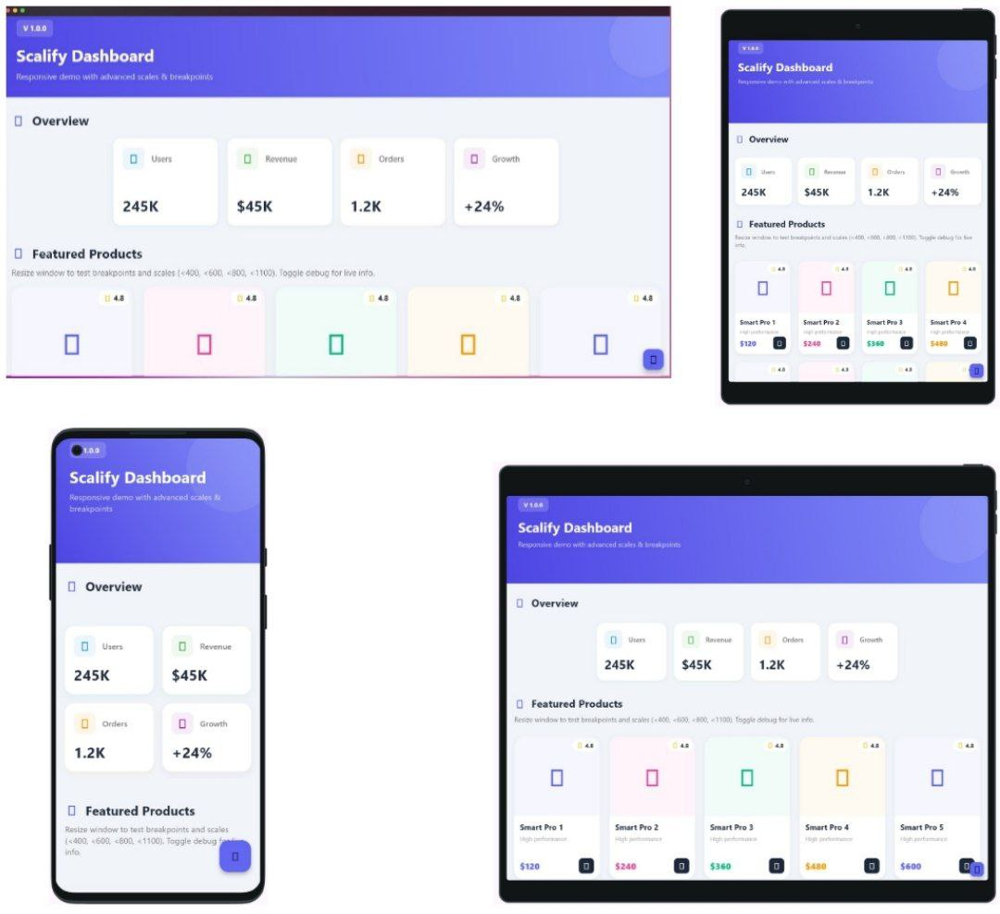

# Flutter Scalify 🚀

[](https://pub.dev/packages/flutter_scalify)
[](https://opensource.org/licenses/MIT)

**The Intelligent Scaling Engine for Flutter.**

Not just a screen adaptation tool, but a complete high-performance engine designed for Mobile, Web, and Desktop. Easily scale your UI elements (text, spacing, icons, containers) across all screen sizes with simple extensions and smart container queries.


## Why Scalify? ⚡️

| Feature | Scalify Engine 🚀 | Standard Solutions |
| :--- | :--- | :--- |
| **Performance** | ✅ **O(1) Inline Math** (Zero Overhead) | ❌ Complex Calculations |
| **Memory Efficiency** | ✅ **Zero Allocation Strategy** (No Garbage Collection pressure) | ❌ High Memory Usage |
| **Rebuilds** | ✅ **Smart Equality Checks** (Prevents Phantom Rebuilds) | ❌ Rebuilds on every pixel change |
| **4K/Desktop Support** | ✅ **Smart Dampening** (Prevents UI explosion) | ❌ Linear Scaling Only |
| **Container Queries** | ✅ **ScalifyBox** (Scale by parent size) | ❌ Global Screen Only |

## Features ✨

- 🎯 **Simple API**: Use intuitive extensions like `16.fz`, `20.s`, `24.iz`.
- 🚀 **Hyper Performance**: Uses `vm:prefer-inline` for direct memory access, making it the fastest scaling logic available.
- 📦 **Container Queries**: New `ScalifyBox` widget to scale elements based on their **parent** size (Local Scaling).
- 🛡️ **4K Memory Protection**: Smart algorithm that dampens scaling on ultra-wide screens to save RAM and maintain aesthetics.
- 🧠 **Smart Rebuilds**: Advanced equality checks prevent unnecessary UI rebuilds when keyboard opens or metrics barely change.
- 📱 **Fully Responsive**: Automatically adapts to Watch, Mobile, Tablet, Desktop, and 4K.
- 🔧 **Flexible**: Works with any Flutter widget.

## Responsive Preview



## Installation

Add this to your package's `pubspec.yaml` file:

```yaml
dependencies:
  flutter_scalify: ^2.0.1
```

Then run:

```bash
flutter pub get
```

## Quick Start & Usage

### 1\. Wrap your app with ResponsiveProvider

Initialize the engine with your design specifications. You can now tune the **4K protection** logic.

```dart
import 'package:flutter/material.dart';
import 'package:flutter_scalify/flutter_scalify.dart';

void main() {
  runApp(const MyApp());
}

class MyApp extends StatelessWidget {
  const MyApp({super.key});

  @override
  Widget build(BuildContext context) {
    return MaterialApp(
      builder: (context, child) {
        return ResponsiveProvider(
          config: const ResponsiveConfig(
            designWidth: 375,
            designHeight: 812,
            minScale: 0.5,
            maxScale: 3.0,
            // 🛡️ New: Protects UI on large screens (4K/UltraWide)
            memoryProtectionThreshold: 1920.0, 
            highResScaleFactor: 0.60, 
          ),
          child: child ?? const SizedBox(),
        );
      },
      home: const ScalifyLabScreen(),
    );
  }
}
```

### 2\. Use the extensions (Global Scaling)

Scale elements based on the **screen size**:

```dart
Text(
  "Hello World",
  style: TextStyle(fontSize: 16.fz), // Smart font scaling
)

Container(
  padding: 16.p,                      // Optimized Responsive padding
  margin: [20, 10].p,                 // List-based shortcut [horizontal, vertical]
  width: 200.w,                       // Width-driven scale
  height: 100.h,                      // Height-driven scale
  decoration: BoxDecoration(
    borderRadius: 12.br,              // Optimized Responsive border radius
  ),
  child: Icon(Icons.home, size: 24.iz), // Responsive icon size
)
```

## 📦 ScalifyBox (Local Scaling / Container Queries)

**New in v2.0:** Stop calculating layout math manually\! Use `ScalifyBox` to scale elements based on their **parent container**, not the screen. This is perfect for **Grids** and **Cards** that need to maintain their internal proportions regardless of how many columns are on the screen.

```dart
// Example: A Card designed to be 200px wide
ScalifyBox(
  referenceWidth: 200, 
  fit: ScalifyFit.contain, // Ensures content never overflows
  builder: (context, ls) { // ls = LocalScaler
    return Container(
      padding: ls.p(10), // Local padding (relative to the box)
      decoration: BoxDecoration(
        borderRadius: ls.br(20), // Local radius
      ),
      child: Column(
        children: [
          Icon(Icons.star, size: ls.s(50)), // Icon will occupy 25% of the card width
          Text("Title", style: TextStyle(fontSize: ls.fz(18))),
        ],
      ),
    );
  },
)
```

### `ScalifyFit` Modes:

  - `width`: Scale based on width (Default).
  - `height`: Scale based on height.
  - `contain`: Scales based on the smaller dimension (Prevents Overflow).
  - `cover`: Scales based on the larger dimension.

## Available Extensions

### Text & Sizing

  - `16.fz` - Font size (text size) - respects accessibility & 4K protection.
  - `24.iz` - Icon size.
  - `100.w` - Width-driven scale.
  - `50.h` - Height-driven scale.
  - `12.r` - Radius (uses smaller scale factor).
  - `48.ui` - UI elements (buttons, inputs).
  - `1.5.sc` - General scaling factor.

### Spacing & Layout

  - `20.s` - Space (used for margins, padding, etc.).
  - `20.sbh` - `SizedBox` height.
  - `30.sbw` - `SizedBox` width.

### Padding Shortcuts (Optimized ⚡️)

  - `16.p` - Padding all sides.
  - `16.ph` - Padding horizontal.
  - `16.pv` - Padding vertical.
  - `[16, 24].p` - Symmetric padding (horizontal 16, vertical 24).
  - `[10, 20, 30, 40].p` - LTRB padding.

## Responsive Grid Example (Adaptive)

Easily build adaptive grids that change column counts based on screen width:

```dart
Widget build(BuildContext context) {
  // Use the context extension
  final width = context.responsiveData.size.width;
  
  // Define columns based on breakpoints
  int columns;
  if (width < 600) columns = 1;
  else if (width < 900) columns = 2;
  else columns = 3;

  return GridView.builder(
    gridDelegate: SliverGridDelegateWithFixedCrossAxisCount(
      crossAxisCount: columns,
      crossAxisSpacing: 16.s,
      mainAxisSpacing: 16.s,
      childAspectRatio: 1.0, // Always square!
    ),
    // Use ScalifyBox inside items for perfect internal scaling
    itemBuilder: (context, index) => ScalifyBox(
        referenceWidth: 150,
        builder: (ctx, ls) => MyCard(scaler: ls),
    ),
  );
}
```

## Screen Breakpoints

The package automatically detects screen sizes based on width:

  - **Watch**: \< 300px
  - **Mobile**: 300px - 600px
  - **Tablet**: 600px - 900px
  - **Small Desktop**: 900px - 1200px
  - **Desktop**: 1200px - 1800px
  - **Large Desktop**: \> 1800px

## AppWidthLimiter

Limit the maximum width of your app for better UX on large screens. This centers your content and adds a safe background area.

```dart
AppWidthLimiter(
  maxWidth: 1400,
  horizontalPadding: 16, // Optional outer padding
  child: YourContent(),
)
```

Check out the [example](example/) directory for a complete, beautiful example app that demonstrates all features including a responsive grid that adapts to different screen sizes.

## Author

**Alaa Hassan Damad**

  - Email: alaahassanak772@gmail.com
  - Country: Iraq