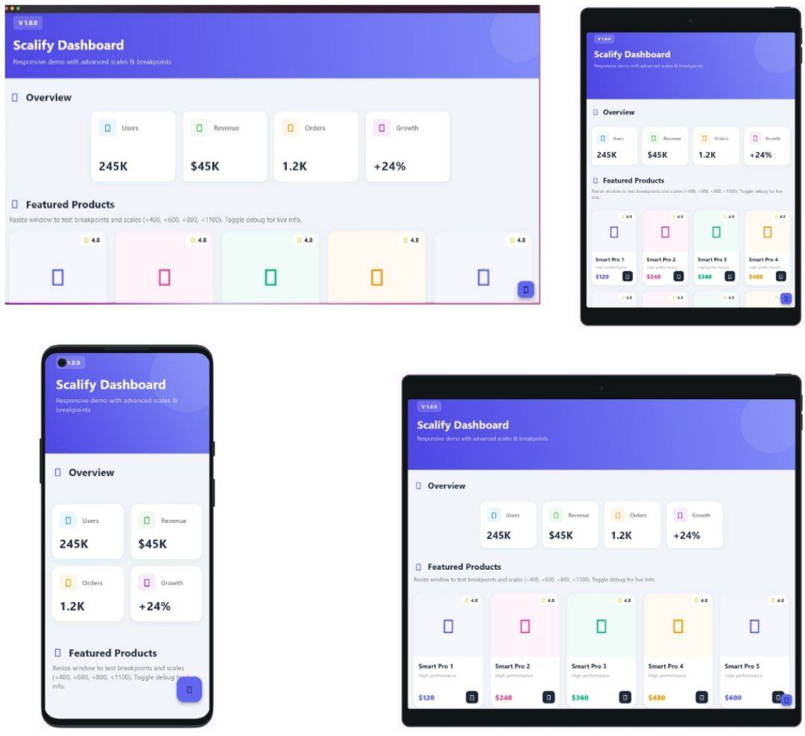

# Flutter Scalify 🚀

[](https://pub.dev/packages/flutter_scalify)
[](https://opensource.org/licenses/MIT)
[](https://flutter.dev)
[](https://dart.dev)
[](#)
[](#)

**The Intelligent Scaling Engine for Flutter.**

A complete, high-performance responsive system — not just a sizing tool. Scale your entire UI across Mobile, Web, and Desktop with simple extensions, smart container queries, and zero overhead.

<p align="center">
  
</p>

---

## Why Scalify? ⚡️

| Feature | Scalify |
| :--- | :---: |
| **O(1) Inline Math** (vm:prefer-inline) | ✅ |
| **Container Queries** (Rebuild by parent size) | ✅ |
| **4K/Ultra-Wide Smart Dampening** | ✅ |
| **Responsive Grid System** (6-Tier) | ✅ |
| **Builder Pattern** (Above MaterialApp) | ✅ |
| **InheritedModel** (Granular Rebuild) | ✅ |
| **Debounce on Resize** (Desktop/Web) | ✅ |
| **Section Scaling** (ScalifySection) | ✅ |
| **Local Scaler** (ScalifyBox) | ✅ |
| **6 Screen Types** (Watch → Large Desktop) | ✅ |
| **Theme Auto-Scaling** (One line) | ✅ |
| **Percentage Scaling** (.pw .hp) | ✅ |
| **Responsive Text** (Auto-resize, ShortText) | ✅ |
| **Design Token Spacing** (xs → xxl) | ✅ |
| **Debug Overlay** (Draggable, Live Metrics) | ✅ |
| **Adaptive Navigation** (Bottom/Rail/Sidebar) | ✅ |
| **Responsive Wrap** (Auto line-wrapping) | ✅ |
| **Responsive Image** (Per-screen sources) | ✅ |
| **Animated Transitions** (Smooth layout switch) | ✅ |
| **Responsive Table** (DataTable ↔ Cards) | ✅ |
| **Responsive Constraints** (Per-screen BoxConstraints) | ✅ |
| **Sliver Widgets** (AppBar/Header/Persistent) | ✅ |
| **Zero External Dependencies** | ✅ |
| **312 Tests Passing** | ✅ |

---

## Features ✨

- 🎯 **Simple API** — `16.fz`, `20.s`, `24.iz`, `300.w` — just add an extension
- 📐 **Responsive Layouts** — Built-in `ResponsiveGrid`, `ResponsiveFlex`, `ResponsiveLayout`
- 📦 **Container Queries** — `ContainerQuery` & `AdaptiveContainer` rebuild based on parent size
- 🛡️ **4K Protection** — Smart dampening prevents UI explosion on ultra-wide screens
- 📱 **6-Tier System** — Watch, Mobile, Tablet, Small Desktop, Desktop, Large Desktop
- ⚡ **Hyper Performance** — `vm:prefer-inline`, Quantized IDs, InheritedModel, Debounce
- 🔡 **Font Clamping** — Configurable min/max font bounds (never too small or too big)
- 🎨 **Theme Scaling** — `ThemeData.scale(context)` — one line, entire theme scaled
- 🧱 **Local Scaling** — `ScalifyBox` scales elements relative to their container
- 🧩 **Section Scaling** — `ScalifySection` creates independent scaling per section for split layouts
- 📊 **Percentage Scaling** — `50.pw` = 50% of screen width, `25.hp` = 25% of height
- 🔤 **Responsive Text** — Auto-resize text with `shortText` for small screens
- 📏 **Design Tokens** — `Spacing.md.gap`, `Spacing.lg.insets` — unified spacing system
- 🔍 **Debug Overlay** — Draggable live metrics panel (debug-only, zero production cost)
- 🌐 **Adaptive Navigation** — Auto-switches Bottom → Rail → Sidebar by screen size
- 🔄 **Responsive Wrap** — Auto-wrapping layout with scaled spacing
- 🖼️ **Responsive Image** — Different images per screen type with memory optimization
- 🎭 **Animated Transitions** — Smooth animations between responsive layouts
- 📊 **Responsive Table** — DataTable on desktop, cards on mobile with sorting
- 🧮 **Responsive Constraints** — Per-screen BoxConstraints with optional scaling
- 🏗️ **Scalify Slivers** — Responsive SliverAppBar, SliverHeader, & SliverPersistentHeader

---

## Responsive Preview



---

## Installation

```yaml
dependencies:
  flutter_scalify: ^3.0.0
```

```bash
flutter pub get
```

---

## Quick Start

### ✅ Recommended: Builder Pattern (ScalifyProvider wraps MaterialApp)

This is the **best practice** for maximum performance. Placing `ScalifyProvider` **above** `MaterialApp` prevents cascading rebuilds when screen size changes.

```dart
import 'package:flutter/material.dart';
import 'package:flutter_scalify/flutter_scalify.dart';

void main() => runApp(const MyApp());

class MyApp extends StatelessWidget {
  const MyApp({super.key});

  @override
  Widget build(BuildContext context) {
    return ScalifyProvider(
      config: const ScalifyConfig(
        designWidth: 375,    // Your Figma/XD design width
        designHeight: 812,   // Your Figma/XD design height
      ),
      builder: (context, child) => MaterialApp(
        theme: ThemeData.light().scale(context), // 🎨 Auto-scale theme
        home: child,
      ),
      child: const HomeScreen(),
    );
  }
}
```

### Alternative: Child Pattern (ScalifyProvider inside MaterialApp)

```dart
MaterialApp(
  builder: (context, child) {
    return ScalifyProvider(
      config: const ScalifyConfig(designWidth: 375, designHeight: 812),
      child: child ?? const SizedBox(),
    );
  },
  home: const HomeScreen(),
);
```

> 💡 **Tip:** The builder pattern is recommended because it puts `ScalifyProvider` above `MaterialApp`, so changing window size doesn't rebuild `MaterialApp` itself.

---

## ⚙️ ScalifyConfig — Full Reference

> **This is the foundation of Scalify.** Every developer should understand `ScalifyConfig` first — it controls design dimensions, breakpoints, font clamping, scaling bounds, 4K protection, and performance tuning. All other features depend on these settings.

```dart
ScalifyConfig(
  // ─── 📐 Design Baseline ──────────────────────────────────────────
  // These values should match your UI design file (e.g., Figma, XD).
  // Scalify calculates scale factors by comparing actual screen size
  // to these reference dimensions.
  designWidth: 375.0,             // Your design's reference width in pixels
  designHeight: 812.0,            // Your design's reference height in pixels

  // ─── 📱 Breakpoints ──────────────────────────────────────────────
  // Define exact pixel boundaries for each screen type.
  // These control when ResponsiveGrid, ResponsiveVisibility,
  // ResponsiveNavigation, etc. switch their layout.
  watchBreakpoint: 300.0,         // < 300px = Watch
  mobileBreakpoint: 600.0,        // 300–600px = Mobile
  tabletBreakpoint: 900.0,        // 600–900px = Tablet
  smallDesktopBreakpoint: 1200.0, // 900–1200px = Small Desktop
  desktopBreakpoint: 1800.0,      // 1200–1800px = Desktop
  //                               // > 1800px = Large Desktop

  // ─── 🔡 Font Control ─────────────────────────────────────────────
  // These ensure font sizes remain readable on all devices.
  // .fz extension uses these bounds for clamping.
  minFontSize: 6.0,               // Minimum allowed font size (floor)
  maxFontSize: 256.0,             // Maximum allowed font size (ceiling)
  respectTextScaleFactor: true,   // Respect system accessibility text scaling

  // ─── 📏 Scale Bounds ──────────────────────────────────────────────
  // Prevent extreme scaling that would distort the UI.
  // E.g., on a 4K monitor, the scale might be 5.0x — maxScale caps it.
  minScale: 0.5,                  // UI never scales below 50%
  maxScale: 4.0,                  // UI never scales above 400%

  // ─── 🛡️ 4K / Ultra-Wide Protection ───────────────────────────────
  // On very wide screens (e.g., 3840px), raw scaling would make text
  // enormous. Smart Dampening kicks in above the threshold width.
  memoryProtectionThreshold: 1920.0,  // Width where dampening starts
  highResScaleFactor: 0.65,           // Dampening strength (0.0–1.0)
  //   0.0 = full dampening (scale stops growing)
  //   1.0 = no dampening (linear scaling continues)
  //   0.65 = balanced (recommended)

  // ─── ⚡ Performance Tuning ────────────────────────────────────────
  // These prevent excessive widget rebuilds during window resizing
  // (Desktop/Web). Most apps can use defaults.
  debounceWindowMillis: 120,          // Wait 120ms after last resize event
  rebuildScaleThreshold: 0.01,        // Ignore scale changes < 1%
  rebuildWidthPxThreshold: 4.0,       // Ignore width changes < 4px
  enableGranularNotifications: false, // Enable InheritedModel aspect filtering

  // ─── 🔄 Orientation ──────────────────────────────────────────────
  // If true, swaps designWidth/designHeight in landscape orientation.
  // Useful for apps that have separate landscape designs.
  autoSwapDimensions: false,

  // ─── 🔧 Minimum Window Width ──────────────────────────────────────
  // If > 0, enables horizontal scrolling when the window is narrower
  // than this value. Prevents content from being crushed on tiny windows.
  minWidth: 0.0,

  // ─── 🏷️ Legacy Compatibility ─────────────────────────────────────
  // Only needed when migrating from v1.x with ContainerQuery tier system.
  legacyContainerTierMapping: false,
  showDeprecationBanner: true,        // Shows debug banner when legacy = true
)
```

### 📐 What Each Setting Affects

| Setting | What it controls | Default |
| :--- | :--- | :---: |
| `designWidth` / `designHeight` | Base reference for `.w`, `.h`, `.s`, `.fz` etc. | `375` / `812` |
| `watchBreakpoint` → `desktopBreakpoint` | `ScreenType` classification for all responsive widgets | See above |
| `minFontSize` / `maxFontSize` | `.fz` clamping range | `6` / `256` |
| `minScale` / `maxScale` | Scale factor bounds for all extensions | `0.5` / `4.0` |
| `memoryProtectionThreshold` | 4K dampening activation width | `1920` |
| `highResScaleFactor` | Dampening strength on ultra-wide | `0.65` |
| `debounceWindowMillis` | Resize debounce for Desktop/Web | `120` |
| `rebuildScaleThreshold` | Minimum scale change to trigger rebuild | `0.01` |
| `rebuildWidthPxThreshold` | Minimum px change to trigger rebuild | `4.0` |

> 💡 **Most apps only need to set `designWidth` and `designHeight`.** All other values have smart defaults.

---

## 📚 API Cheat Sheet

### 1. Size & Font

| Extension | Example | Description |
| :---: | :--- | :--- |
| `.w` | `100.w` | **Width** — Scales based on screen width ratio |
| `.h` | `50.h` | **Height** — Scales based on screen height ratio |
| `.s` | `20.s` | **Size** — General scaling (min of width/height) |
| `.fz` | `16.fz` | **Font Size** — Scaled + clamped + accessibility |
| `.iz` | `24.iz` | **Icon Size** — Proportional icon scaling |
| `.r` | `12.r` | **Radius** — Based on min(scaleWidth, scaleHeight) |
| `.si` | `10.si` | **Scaled Int** — Rounded integer for native APIs |
| `.sc` | `16.sc` | **Scale** — Alias for `.s` |
| `.ui` | `16.ui` | **UI** — Alias for `.s` |

### 2. Percentage Scaling

| Extension | Example | Description |
| :---: | :--- | :--- |
| `.pw` | `50.pw` | **50% of screen width** |
| `.hp` | `25.hp` | **25% of screen height** |

### 3. Spacing (SizedBox)

| Extension | Example | Output |
| :---: | :--- | :--- |
| `.sbh` | `20.sbh` | `SizedBox(height: 20.h)` |
| `.sbw` | `10.sbw` | `SizedBox(width: 10.w)` |
| `.sbhw()` | `20.sbhw(width: 10)` | `SizedBox(height: 20.h, width: 10.w)` |
| `.sbwh()` | `10.sbwh(height: 20)` | `SizedBox(width: 10.w, height: 20.h)` |

### 4. Padding (EdgeInsets)

| Extension | Example | Output |
| :---: | :--- | :--- |
| `.p` | `16.p` | `EdgeInsets.all(16.s)` |
| `.ph` | `16.ph` | `EdgeInsets.symmetric(horizontal: 16.w)` |
| `.pv` | `16.pv` | `EdgeInsets.symmetric(vertical: 16.h)` |
| `.pt` | `16.pt` | `EdgeInsets.only(top: 16.h)` |
| `.pb` | `16.pb` | `EdgeInsets.only(bottom: 16.h)` |
| `.pl` | `16.pl` | `EdgeInsets.only(left: 16.w)` |
| `.pr` | `16.pr` | `EdgeInsets.only(right: 16.w)` |

**List Shorthand:**

```dart
[20, 10].p      // EdgeInsets.symmetric(horizontal: 20.w, vertical: 10.h)
[10, 5, 10, 5].p // EdgeInsets.fromLTRB(10.w, 5.h, 10.w, 5.h)
```

### 5. Border Radius

| Extension | Example | Output |
| :---: | :--- | :--- |
| `.br` | `12.br` | `BorderRadius.circular(12.r)` |
| `.brt` | `12.brt` | Top corners only |
| `.brb` | `12.brb` | Bottom corners only |
| `.brl` | `12.brl` | Left corners only |
| `.brr` | `12.brr` | Right corners only |

### 6. Context API (for `const` widgets)

When widgets are inside a `const` tree and can't use global extensions, use context:

```dart
context.w(100)    // Width scaling
context.h(50)     // Height scaling
context.r(12)     // Radius (min of scaleWidth/scaleHeight)
context.sp(16)    // Scale factor
context.fz(18)    // Font size (clamped + accessibility)
context.iz(24)    // Icon size
context.s(10)     // General scale
context.pw(50)    // 50% of screen width
context.hp(25)    // 25% of screen height
```

---

## 💻 Complete Example

```dart
Container(
  padding: [20, 10].p,           // Symmetric padding
  width: 300.w,                   // Responsive width
  height: 200.h,                  // Responsive height
  decoration: BoxDecoration(
    color: Colors.white,
    borderRadius: 20.brt,         // Top border radius
    boxShadow: [
      BoxShadow(
        color: Colors.black12,
        offset: Offset(0, 4.s),   // Scaled offset
        blurRadius: 10.s,
      )
    ],
  ),
  child: Column(
    children: [
      Icon(Icons.star, size: 32.iz),                                  // Scaled icon
      16.sbh,                                                          // Spacing
      Text("Scalify", style: TextStyle(fontSize: 24.fz)),             // Scaled font
      8.sbh,
      Row(
        mainAxisAlignment: MainAxisAlignment.center,
        children: [
          Text("Start", style: TextStyle(fontSize: 14.fz)),
          8.sbw,                                                       // Width spacing
          Icon(Icons.arrow_forward, size: 16.iz),
        ],
      )
    ],
  ),
)
```

---

## 🚀 Responsive Widgets

### ResponsiveGrid — The Ultimate Grid

Supports **Manual Columns** (per screen type) and **Auto-Fit** (dynamic data).

**Manual Mode:**

```dart
ResponsiveGrid(
  spacing: 16,
  runSpacing: 16,
  watch: 1,
  mobile: 2,
  tablet: 3,
  smallDesktop: 3,
  desktop: 4,
  largeDesktop: 5,
  children: [/* widgets */],
)
```

**Auto-Fit Mode (API data):**

```dart
ResponsiveGrid(
  minItemWidth: 150,
  itemCount: products.length,
  itemBuilder: (context, index) => ProductCard(data: products[index]),
)
```

**Sliver Mode (infinite scroll):**

```dart
CustomScrollView(
  slivers: [
    ResponsiveGrid(
      useSliver: true,
      mobile: 2,
      desktop: 4,
      itemCount: 100,
      itemBuilder: (context, i) => ItemCard(i),
    ),
  ],
)
```

---

### ResponsiveFlex — Row ↔ Column

Automatically switches between `Row` and `Column` based on screen width.

```dart
ResponsiveFlex(
  switchOn: ScreenType.mobile,    // Column on mobile, Row on larger
  spacing: 20,
  flipOnRtl: true,                // RTL support
  children: [
    UserAvatar(),
    UserInfo(),
  ],
)
```

**Custom breakpoint:**

```dart
ResponsiveFlex(
  breakpoint: 600,                // Column when width < 600
  children: [Widget1(), Widget2()],
)
```

---

### ResponsiveLayout — Orientation Switch

```dart
ResponsiveLayout(
  portrait: Column(children: [Image(), Bio()]),
  landscape: Row(children: [Image(), Bio()]),
)
```

---

### ResponsiveVisibility — Show/Hide by Screen Type

```dart
// Whitelist: Show ONLY on mobile
ResponsiveVisibility(
  visibleOn: [ScreenType.mobile],
  child: MobileNavBar(),
)

// Blacklist: Hide on desktop
ResponsiveVisibility(
  hiddenOn: [ScreenType.desktop, ScreenType.largeDesktop],
  replacement: DesktopSidebar(),   // Optional replacement widget
  child: MobileDrawer(),
)
```

---

### ResponsiveBuilder — Direct Data Access

```dart
ResponsiveBuilder(
  builder: (context, data) {
    return Text("Screen: ${data.screenType} — ${data.width.toInt()}px");
  },
)
```

---

### Conditional Logic — `valueByScreen`

```dart
final columns = context.valueByScreen<int>(
  mobile: 2,
  tablet: 3,
  desktop: 4,
  largeDesktop: 6,
);
```

---

## 📦 Container Queries

### ContainerQuery — Rebuild by Parent Size

Unlike `MediaQuery` which reads the **screen** size, `ContainerQuery` reads the **parent widget's** size. Perfect for reusable components.

```dart
ContainerQuery(
  breakpoints: [200, 400, 800],
  onChanged: (prev, current) => print("Tier: ${current.tier}"),
  builder: (context, query) {
    if (query.isMobile) return CompactCard();
    if (query.isTablet) return MediumCard();
    return FullCard();
  },
)
```

**QueryTier values:** `xs`, `sm`, `md`, `lg`, `xl`, `xxl`

---

### AdaptiveContainer — Tier-Based Widgets

```dart
AdaptiveContainer(
  breakpoints: [200, 500],
  xs: Icon(Icons.home),                    // < 200px
  sm: Column(children: [Icon(), Text()]),  // 200-500px
  lg: Row(children: [Icon(), Text(), Button()]),  // > 500px
)
```

---

## 🧱 ScalifyBox — Local Scaling

Scale elements relative to a **specific container** instead of the screen. Perfect for credit cards, game UIs, and embedded components.

```dart
ScalifyBox(
  referenceWidth: 320,
  referenceHeight: 200,
  fit: ScalifyFit.contain,    // width | height | contain | cover
  builder: (context, ls) {
    return Container(
      width: ls.w(300),         // Local width scaling
      height: ls.h(180),        // Local height scaling
      padding: ls.p(20),        // Local padding
      decoration: BoxDecoration(
        borderRadius: ls.br(12), // Local border radius
      ),
      child: Column(
        children: [
          Text("VISA", style: TextStyle(fontSize: ls.fz(18))),
          ls.sbh(10),            // Local spacing
        ],
      ),
    );
  },
)
```

**LocalScaler API:**

| Method | Description |
| :--- | :--- |
| `ls.w(value)` | Local width scaling |
| `ls.h(value)` | Local height scaling |
| `ls.s(value)` | Local general scaling |
| `ls.fz(value)` | Local font size (clamped) |
| `ls.iz(value)` | Local icon size |
| `ls.si(value)` | Rounded int |
| `ls.p(value)` | `EdgeInsets.all` |
| `ls.ph(value)` | Horizontal padding |
| `ls.pv(value)` | Vertical padding |
| `ls.br(value)` | `BorderRadius.circular` |
| `ls.r(value)` | `Radius.circular` |
| `ls.sbh(value)` | `SizedBox(height:)` |
| `ls.sbw(value)` | `SizedBox(width:)` |
| `ls.scaleFactor` | Current scale value |

---

## 🧩 ScalifySection — Independent Section Scaling

Creates an **independent scaling context** for any part of your UI. Essential for **split-screen** / **master-detail** layouts where each section should scale based on its own width.

```dart
Row(
  children: [
    // Sidebar: scales based on 300px width
    SizedBox(
      width: 300,
      child: ScalifySection(child: Sidebar()),
    ),
    // Main content: scales based on remaining width
    Expanded(
      child: ScalifySection(child: MainContent()),
    ),
  ],
)
```

> 💡 **Tip:** Inside a `ScalifySection`, use **context-based** extensions (`context.fz(16)`, `context.w(100)`) instead of global extensions (`16.fz`, `100.w`) for accurate section-local scaling.

**Full Master-Detail Example:**

```dart
class MasterDetailLayout extends StatelessWidget {
  @override
  Widget build(BuildContext context) {
    final width = MediaQuery.sizeOf(context).width;

    // Mobile: bottom navigation
    if (width < 900) {
      return Scaffold(
        body: MainPages(),
        bottomNavigationBar: BottomNav(),
      );
    }

    // Desktop: sidebar + content — each scales independently
    return Row(
      children: [
        SizedBox(
          width: 300,
          child: ScalifySection(child: Sidebar()),
        ),
        Expanded(
          child: ScalifySection(child: MainPages()),
        ),
      ],
    );
  }
}
```

---

## 🛡️ AppWidthLimiter — Ultra-Wide Protection

Centers and constrains your app on ultra-wide monitors.

```dart
AppWidthLimiter(
  maxWidth: 1400,
  minWidth: 360,               // Enables horizontal scroll below 360px
  horizontalPadding: 16,
  backgroundColor: Color(0xFFE2E8F0),
  child: YourApp(),
)
```

---

## 📏 Best Practices — Consistent UI

Use the right extension for each element to maintain a consistent UI across all screen sizes:

| Element | Use | Why |
| :--- | :---: | :--- |
| **Text / Fonts** | `.fz` | Scaled + clamped + accessibility |
| **Icons** | `.iz` / `.s` | Proportional to screen |
| **Button height** | `.s` | ❌ Never `.h` — distorts on wide screens |
| **Input field height** | `.s` | ❌ Never `.h` — text overflows |
| **Container width** | `.w` | Follows screen width |
| **Container height** | `.s` | Stays proportional |
| **Horizontal padding** | `.w` | Follows width |
| **Vertical spacing** | `.h` | Adapts to screen height |
| **General spacing** | `.s` | Balanced proportional |
| **Border radius** | `.r` / `.br` | Uses min(scaleW, scaleH) |

> ⚠️ **Common Mistake:** Using `.h` for button/input heights causes them to shrink on wide screens (where height < width), making text overflow.
>
> ✅ **Fix:** Use `.s` — it uses `min(scaleWidth, scaleHeight)` which stays balanced.

```dart
// ❌ Wrong — height shrinks on wide screens
SizedBox(height: 48.h, child: ElevatedButton(...))

// ✅ Correct — stays proportional everywhere
SizedBox(height: 48.s, child: ElevatedButton(...))
```

---

## 🎨 Theme Auto-Scaling

Scale your **entire** app theme with one line — no need to add `.fz` to every text widget.

```dart
ScalifyProvider(
  builder: (context, child) => MaterialApp(
    theme: ThemeData.light().scale(context),  // ✨ One line!
    home: child,
  ),
  child: const HomeScreen(),
)
```

> 💡 Automatically skips scaling when `scaleFactor == 1.0` for zero overhead.

---

## 🔄 Live Resizing (Desktop & Web)

For instant UI updates while dragging the window:

**Option 1: ResponsiveBuilder (Recommended)**

```dart
ResponsiveBuilder(
  builder: (context, data) {
    return Scaffold(
      body: Center(
        child: Text("${data.width.toInt()}px", style: TextStyle(fontSize: 20.fz)),
      ),
    );
  },
)
```

**Option 2: Direct Subscription**

```dart
@override
Widget build(BuildContext context) {
  context.responsiveData;  // 👈 Subscribe to resize events
  return Scaffold(/* ... */);
}
```

---

> 📌 **ScalifyConfig** is documented in detail at the top of this file — see [⚙️ ScalifyConfig — Full Reference](#️-scalifyconfig--full-reference).

---

## 📱 Screen Breakpoints

```
┌──────────────┬─────────────────┬──────────────────────────┐
│  Screen Type │   Width Range   │        Enum Value        │
├──────────────┼─────────────────┼──────────────────────────┤
│  Watch       │     < 300px     │  ScreenType.watch        │
│  Mobile      │  300px - 600px  │  ScreenType.mobile       │
│  Tablet      │  600px - 900px  │  ScreenType.tablet       │
│  Small DT    │  900px - 1200px │  ScreenType.smallDesktop │
│  Desktop     │ 1200px - 1800px │  ScreenType.desktop      │
│  Large DT    │    > 1800px     │  ScreenType.largeDesktop │
└──────────────┴─────────────────┴──────────────────────────┘
```

---

## 🧠 Advanced: How the Engine Works

### Configurable Rebuild Tolerance

Scalify uses a **dual-tolerance** system to prevent unnecessary rebuilds:

- **`rebuildWidthPxThreshold`** (default 4.0px) — Ignores sub-pixel size changes
- **`rebuildScaleThreshold`** (default 0.01) — Ignores scale changes < 1%

```
Screen: 375px → 377px (2px diff < 4px threshold)
Scale:  1.000 → 1.005 (0.005 diff < 0.01 threshold)
→ No rebuild! ✅
```

Internally, Quantized IDs (×1000) are still used for `InheritedModel` aspect-based comparisons to ensure fast integer equality checks.

### InheritedModel Aspects

Enable granular notifications to rebuild widgets **only** when specific data changes:

```dart
// Only rebuilds when screen TYPE changes (not on every pixel resize)
ScalifyProvider.of(context, aspect: ScalifyAspect.type);

// Only rebuilds when scale FACTOR changes
ScalifyProvider.of(context, aspect: ScalifyAspect.scale);

// Only rebuilds when text scale changes (accessibility)
ScalifyProvider.of(context, aspect: ScalifyAspect.text);
```

Enable in config:

```dart
ScalifyConfig(enableGranularNotifications: true)
```

### Debounce on Resize

On Desktop/Web, window resizing fires hundreds of events per second. Scalify debounces platform-driven resize events with a configurable window (`debounceWindowMillis`, default 120ms), calculating the layout **once** after the user stops dragging. Parent-driven updates (e.g., `didChangeDependencies`) remain synchronous for instant response.

```dart
// Disable debounce for instant updates:
ScalifyConfig(debounceWindowMillis: 0)

// Increase debounce for weaker devices:
ScalifyConfig(debounceWindowMillis: 200)
```

### Nested Providers & Performance (`observeMetrics`)

When nesting `ScalifyProvider` (e.g., for a split-screen section), the inner provider should **not** listen to window resize events directly, as this creates a "double debounce" race condition with the parent provider, causing UI lag.

To fix this, set `observeMetrics: false` on the nested provider:

```dart
ScalifyProvider(
  config: sectionConfig,
  observeMetrics: false, // ⚡️ Disables internal resize listener
  child: SectionContent(),
)
```

This ensures the inner provider updates **synchronously** when its parent rebuilds, resulting in 60fps performance during window resizing. `ScalifySection` handles this automatically.

### 4K Smart Dampening

For screens wider than `memoryProtectionThreshold` (default 1920px):

```
Normal: scale = screenWidth / designWidth
4K:     scale = thresholdScale + (excessWidth / designWidth × dampFactor)
```

This prevents text from becoming 5× the intended size on ultra-wide monitors.

---

## 📋 Migration from v2.x → v3.0.0

### 1. Builder Pattern (Recommended)

```diff
- MaterialApp(
-   builder: (context, child) => ScalifyProvider(child: child),
-   home: HomeScreen(),
- )
+ ScalifyProvider(
+   builder: (context, child) => MaterialApp(home: child),
+   child: const HomeScreen(),
+ )
```

### 2. Context API for `const` Widgets

```diff
- // Won't update in const trees
- Text("Hi", style: TextStyle(fontSize: 16.fz))

+ // Always updates via context
+ Builder(
+   builder: (context) => Text(
+     "Hi",
+     style: TextStyle(fontSize: context.sp(16)),
+   ),
+ )
```

### 3. Percentage Scaling (New)

```dart
SizedBox(width: 50.pw)   // 50% of screen width
SizedBox(height: 25.hp)  // 25% of screen height
```

### 4. Theme Scaling (New)

```dart
MaterialApp(
  theme: ThemeData.light().scale(context),
)
```

---

## 🔤 ResponsiveText — Smart Auto-Resizing Text

A text widget that automatically shrinks font size to fit available space, and optionally shows shorter text on small screens.

### Basic Usage

```dart
ResponsiveText(
  'Welcome to our Amazing Application',
  style: TextStyle(fontSize: 18.fz),
  maxLines: 2,
)
```

### Auto-Resize (Shrink to Fit)

```dart
ResponsiveText(
  'This long heading will shrink to fit any container width',
  style: TextStyle(fontSize: 24.fz, fontWeight: FontWeight.bold),
  autoResize: true,        // Enables auto-shrinking
  minFontSize: 12,         // Never shrinks below 12px
  maxLines: 1,
)
```

### Short Text for Small Screens

```dart
ResponsiveText(
  'Welcome to our Premium Shopping Experience',
  shortText: 'Welcome',   // Shows on mobile/watch
  style: TextStyle(fontSize: 20.fz),
)
```

### API Reference

| Parameter | Type | Default | Description |
| :--- | :--- | :---: | :--- |
| `text` | `String` | required | The full text to display |
| `shortText` | `String?` | `null` | Abbreviated text for small screens |
| `autoResize` | `bool` | `false` | Enable auto font-size shrinking |
| `minFontSize` | `double` | `8.0` | Floor for auto-resize |
| `stepGranularity` | `double` | `0.5` | Precision of resize steps |
| `maxLines` | `int?` | `null` | Maximum number of lines |
| `overflow` | `TextOverflow` | `ellipsis` | Overflow behavior |

> 💡 **Performance**: When `autoResize` is `false`, no `LayoutBuilder` is used — zero overhead.

---

## 📏 ResponsiveSpacing — Design Token System

A unified spacing system with predefined, scaled values — like design tokens in Figma.

### Setup (Optional)

```dart
// Customize spacing values (or use defaults: 4, 8, 16, 24, 32, 48)
ScalifySpacing.init(const SpacingScale(
  xs: 4,
  sm: 8,
  md: 16,
  lg: 24,
  xl: 32,
  xxl: 48,
));
```

### Usage

```dart
Column(
  children: [
    Text('Title', style: TextStyle(fontSize: 24.fz)),
    Spacing.sm.gap,         // SizedBox(height: 8 * scaleFactor)
    Text('Subtitle'),
    Spacing.md.gap,         // SizedBox(height: 16 * scaleFactor)
    Text('Body text'),
  ],
)

Container(
  padding: Spacing.lg.insets,    // EdgeInsets.all(24 * scaleFactor)
  margin: Spacing.sm.insetsH,   // EdgeInsets.symmetric(horizontal: 8.s)
  child: Content(),
)
```

### Spacing API

| Extension | Output | Example |
| :--- | :--- | :--- |
| `.gap` | `SizedBox(height: scaled)` | `Spacing.md.gap` |
| `.gapW` | `SizedBox(width: scaled)` | `Spacing.sm.gapW` |
| `.gapAll` | `SizedBox(width: s, height: s)` | `Spacing.lg.gapAll` |
| `.value` | `double` (raw scaled value) | `Spacing.xl.value` |
| `.insets` | `EdgeInsets.all(scaled)` | `Spacing.md.insets` |
| `.insetsH` | `EdgeInsets.symmetric(horizontal:)` | `Spacing.lg.insetsH` |
| `.insetsV` | `EdgeInsets.symmetric(vertical:)` | `Spacing.sm.insetsV` |
| `.insetsT` | `EdgeInsets.only(top:)` | `Spacing.md.insetsT` |
| `.insetsB` | `EdgeInsets.only(bottom:)` | `Spacing.md.insetsB` |
| `.insetsL` | `EdgeInsets.only(left:)` | `Spacing.sm.insetsL` |
| `.insetsR` | `EdgeInsets.only(right:)` | `Spacing.sm.insetsR` |

### Default Scale Values

| Tier | Value | Use Case |
| :---: | :---: | :--- |
| `xs` | 4 | Tight spacing, chip gaps |
| `sm` | 8 | List item padding, small gaps |
| `md` | 16 | Card padding, section gaps |
| `lg` | 24 | Section spacing, content margins |
| `xl` | 32 | Large section gaps |
| `xxl` | 48 | Page-level spacing |

> 💡 All spacing values are automatically scaled via `GlobalResponsive.scaleFactor`.

---

## 🔍 ScalifyDebugOverlay — Developer Tools

A draggable, collapsible debug panel showing live responsive metrics. **Zero overhead in release builds.**

### Usage

```dart
ScalifyProvider(
  builder: (context, child) => MaterialApp(
    home: ScalifyDebugOverlay(
      child: child!,
    ),
  ),
  child: const HomeScreen(),
)
```

### What It Shows

```
┌─────────────────────────────────┐
│ 📱 MOBILE                       │
│ 📐 Size     375 × 812           │
│ ⚖️  Scale    1.000               │
│ ↔️  ScaleW   1.000               │
│ ↕️  ScaleH   1.000               │
│ 🔤 TextSF   1.00                │
│ 🔄 Rebuilds 3                   │
└─────────────────────────────────┘
```

### Features

- 🎨 **Color-coded** screen type indicator
- 🖱️ **Draggable** — move anywhere on screen
- 📐 **Collapsible** — tap header to toggle
- 🛡️ **Zero production cost** — uses `kDebugMode` guard
- 🎯 **RepaintBoundary** — isolated repaints

### API

| Parameter | Type | Default | Description |
| :--- | :--- | :---: | :--- |
| `enabled` | `bool` | `true` | Enable/disable (still debug-only) |
| `initialTop` | `double` | `50.0` | Initial Y position |
| `initialRight` | `double` | `16.0` | Initial X position |

---

## 🌐 ResponsiveNavigation — Adaptive Navigation

Automatically switches between `BottomNavigationBar`, `NavigationRail`, and a sidebar drawer based on screen size.

### Usage

```dart
class MyApp extends StatefulWidget {
  @override
  State<MyApp> createState() => _MyAppState();
}

class _MyAppState extends State<MyApp> {
  int _selectedIndex = 0;

  final _pages = [
    const HomePage(),
    const SearchPage(),
    const ProfilePage(),
  ];

  @override
  Widget build(BuildContext context) {
    return ResponsiveNavigation(
      destinations: const [
        NavDestination(icon: Icons.home, label: 'Home'),
        NavDestination(icon: Icons.search, label: 'Search'),
        NavDestination(
          icon: Icons.person,
          label: 'Profile',
          badge: 3,  // Badge support!
        ),
      ],
      selectedIndex: _selectedIndex,
      onChanged: (i) => setState(() => _selectedIndex = i),
      body: _pages[_selectedIndex],
    );
  }
}
```

### Navigation Modes

```
┌───────────┬───────────────────┬─────────────────────┐
│  Screen   │   Navigation      │    Breakpoint        │
├───────────┼───────────────────┼─────────────────────┤
│  Mobile   │  BottomNavBar     │  ≤ railBreakpoint    │
│  Tablet   │  NavigationRail   │  ≤ sidebarBreakpoint │
│  Desktop  │  Sidebar Drawer   │  > sidebarBreakpoint │
└───────────┴───────────────────┴─────────────────────┘
```

### Custom Bottom Navigation

Use `bottomNavBuilder` for **full UI control** over the bottom navigation bar:

```dart
ResponsiveNavigation(
  destinations: destinations,
  selectedIndex: _index,
  onChanged: (i) => setState(() => _index = i),
  body: pages[_index],
  bottomNavBuilder: (context, destinations, selected, onChanged) {
    return BottomNavigationBar(
      currentIndex: selected,
      onTap: onChanged,
      items: destinations.map((d) => BottomNavigationBarItem(
        icon: Icon(d.icon),
        label: d.label,
      )).toList(),
    );
  },
)
```

### Sidebar Footer, Header & Hidden Items

Add custom widgets to the sidebar and hide specific destinations from it:

```dart
ResponsiveNavigation(
  destinations: [
    NavDestination(icon: Icons.home, label: 'Home'),
    NavDestination(icon: Icons.search, label: 'Search'),
    NavDestination(
      icon: Icons.person,
      label: 'Profile',
      showInSidebar: false,  // ✅ Hidden from sidebar, visible in bottom nav
    ),
  ],
  selectedIndex: _index,
  onChanged: (i) => setState(() => _index = i),
  body: pages[_index],
  sidebarHeader: Padding(
    padding: EdgeInsets.all(16),
    child: Row(
      children: [Icon(Icons.apps), SizedBox(width: 8), Text('My App')],
    ),
  ),
  sidebarFooter: ListTile(
    leading: CircleAvatar(child: Text('A')),
    title: Text('Alaa Hassan'),
    subtitle: Text('Admin'),
  ),
)
```

### Nested Navigation

`ResponsiveNavigation` supports nested navigation — the sidebar stays fixed while tab content navigates independently:

```dart
ResponsiveNavigation(
  destinations: destinations,
  selectedIndex: _index,
  onChanged: (i) => setState(() => _index = i),
  body: IndexedStack(
    index: _index,
    children: [
      Navigator(  // Each tab has its own navigation stack
        key: _navKeys[0],
        onGenerateRoute: (_) => MaterialPageRoute(
          builder: (_) => ListPage(navKey: _navKeys[0]),
        ),
      ),
      Navigator(key: _navKeys[1], /* ... */),
    ],
  ),
)
```

> 💡 **Key:** Use `IndexedStack` + per-tab `Navigator` with `GlobalKey<NavigatorState>` to preserve tab state and enable push/pop within each tab while the sidebar remains visible.

### API Reference

| Parameter | Type | Default | Description |
| :--- | :--- | :---: | :--- |
| `destinations` | `List<NavDestination>` | required | Nav items |
| `selectedIndex` | `int` | required | Current selection |
| `onChanged` | `ValueChanged<int>` | required | Selection callback |
| `body` | `Widget` | required | Main content |
| `bottomNavBuilder` | `BottomNavBuilder?` | `null` | Full custom bottom nav UI |
| `sidebarHeader` | `Widget?` | `null` | Widget above sidebar items |
| `sidebarFooter` | `Widget?` | `null` | Widget below sidebar items |
| `drawerWidth` | `double` | `280.0` | Sidebar width |
| `railExtended` | `bool` | `false` | Rail shows labels inline |
| `showLabels` | `bool` | `true` | Show rail labels |
| `elevation` | `double` | `0.0` | Surface elevation |
| `railBreakpoint` | `ScreenType` | `mobile` | Bottom→Rail switch |
| `sidebarBreakpoint` | `ScreenType` | `smallDesktop` | Rail→Sidebar switch |
| `backgroundColor` | `Color?` | theme | Background color |
| `selectedColor` | `Color?` | primary | Selected item color |

### NavDestination Properties

| Property | Type | Default | Description |
| :--- | :--- | :---: | :--- |
| `icon` | `IconData` | required | Icon for the destination |
| `label` | `String` | required | Label text |
| `selectedIcon` | `IconData?` | `null` | Icon when selected |
| `badge` | `int?` | `null` | Badge count (shows as chip) |
| `showInSidebar` | `bool` | `true` | Whether to show in sidebar mode |

---

## 🔄 ResponsiveWrap — Smart Auto-Wrapping

A widget that lays out children horizontally and wraps to the next line automatically when space runs out — perfect for chips, tags, and button groups.

### Usage

```dart
ResponsiveWrap(
  spacing: 12,
  runSpacing: 8,
  children: [
    FilterChip(label: Text('All')),
    FilterChip(label: Text('Clothes')),
    FilterChip(label: Text('Electronics')),
    FilterChip(label: Text('Shoes')),
    FilterChip(label: Text('Books')),
  ],
)
```

### API

| Parameter | Type | Default | Description |
| :--- | :--- | :---: | :--- |
| `children` | `List<Widget>` | required | Widgets to layout |
| `spacing` | `double` | `8.0` | Horizontal gap (auto-scaled) |
| `runSpacing` | `double` | `8.0` | Vertical gap between lines |
| `alignment` | `WrapAlignment` | `start` | Main axis alignment |
| `crossAxisAlignment` | `WrapCrossAlignment` | `center` | Cross axis alignment |
| `scaleSpacing` | `bool` | `true` | Scale spacing via `.s` |
| `padding` | `EdgeInsetsGeometry?` | `null` | Outer padding |

> 💡 Unlike `ResponsiveFlex` (Row↔Column), `ResponsiveWrap` wraps items **line by line** without switching direction.

---

## 🖼️ ResponsiveImage — Screen-Adaptive Images

Displays different image sources based on screen type, optimizing memory and visual quality.

### Usage

```dart
ResponsiveImage(
  mobile: AssetImage('assets/banner_sm.webp'),
  tablet: AssetImage('assets/banner_md.webp'),
  desktop: AssetImage('assets/banner_lg.webp'),
  fit: BoxFit.cover,
  height: 200.s,
  borderRadius: BorderRadius.circular(12),
)
```

### With Placeholder & Auto-Optimize

```dart
ResponsiveImage(
  mobile: NetworkImage('https://example.com/sm.jpg'),
  desktop: NetworkImage('https://example.com/lg.jpg'),
  autoOptimize: true,  // Decodes at display size to save memory
  width: 300.w,
  height: 200.s,
  placeholder: Center(child: CircularProgressIndicator()),
  errorWidget: Icon(Icons.broken_image),
)
```

### API

| Parameter | Type | Default | Description |
| :--- | :--- | :---: | :--- |
| `mobile` | `ImageProvider` | required | Image for mobile (fallback) |
| `tablet` | `ImageProvider?` | `null` | Image for tablet |
| `desktop` | `ImageProvider?` | `null` | Image for desktop |
| `fit` | `BoxFit` | `cover` | How to fit the image |
| `autoOptimize` | `bool` | `false` | Decode at display size |
| `placeholder` | `Widget?` | `null` | Loading placeholder |
| `errorWidget` | `Widget?` | `null` | Error fallback |
| `borderRadius` | `BorderRadius?` | `null` | Rounded corners |

> 💡 Fallback chain: `desktop → tablet → mobile` — always displays something.

---

## 🎭 AnimatedResponsiveTransition — Smooth Layout Switching

Animates smoothly between different responsive layouts when the screen type changes. Essential for polished Desktop/Web experiences.

### Usage

```dart
AnimatedResponsiveTransition(
  duration: Duration(milliseconds: 300),
  transition: ResponsiveTransitionType.fadeSlide,
  mobile: CompactCard(),
  tablet: MediumCard(),
  desktop: ExpandedCard(),
)
```

### Available Transitions

| Type | Visual Effect |
| :--- | :--- |
| `ResponsiveTransitionType.fade` | Simple fade between layouts |
| `ResponsiveTransitionType.fadeSlide` | Fade + horizontal slide |
| `ResponsiveTransitionType.scale` | Scale up/down transition |
| `ResponsiveTransitionType.fadeScale` | Fade + subtle scale |

### Custom Transition

```dart
AnimatedResponsiveTransition(
  mobile: MobileLayout(),
  desktop: DesktopLayout(),
  customTransitionBuilder: (child, animation) {
    return RotationTransition(turns: animation, child: child);
  },
)
```

### API

| Parameter | Type | Default | Description |
| :--- | :--- | :---: | :--- |
| `mobile` | `Widget` | required | Mobile layout (fallback) |
| `tablet` | `Widget?` | `null` | Tablet layout |
| `desktop` | `Widget?` | `null` | Desktop layout |
| `duration` | `Duration` | `300ms` | Animation duration |
| `curve` | `Curve` | `easeInOut` | Animation curve |
| `transition` | `ResponsiveTransitionType` | `fade` | Transition type |
| `customTransitionBuilder` | `Function?` | `null` | Custom override |

> 💡 Animation only triggers on **ScreenType** change — not on sub-pixel resize events.

---

## 📊 ResponsiveTable — Adaptive Data Display

A table that automatically switches between a full `DataTable` on desktop and a card list on mobile. Supports sorting, column hiding, and custom card layouts.

### Basic Usage

```dart
ResponsiveTable(
  columns: ['Name', 'Price', 'Status', 'Date'],
  rows: [
    ['iPhone 15', '\$999', 'Available', '2024-01-15'],
    ['MacBook Pro', '\$1999', 'Sold Out', '2024-02-20'],
    ['AirPods', '\$249', 'Available', '2024-03-10'],
  ],
  hiddenColumnsOnMobile: [3],  // Hide 'Date' on mobile
)
```

### Custom Mobile Cards

```dart
ResponsiveTable(
  columns: ['Name', 'Price', 'Status'],
  rows: products.map((p) => [p.name, p.price, p.status]).toList(),
  mobileCardBuilder: (context, row, headers) => Card(
    child: ListTile(
      leading: Icon(Icons.shopping_bag),
      title: Text(row[0].toString()),
      subtitle: Text(row[1].toString()),
      trailing: Chip(label: Text(row[2].toString())),
    ),
  ),
  onRowTap: (index, row) => print('Tapped: $row'),
)
```

### With Sorting

```dart
ResponsiveTable(
  columns: ['Name', 'Price'],
  rows: data,
  showSortIndicator: true,
  sortColumnIndex: _sortIndex,
  sortAscending: _ascending,
  onSort: (column, ascending) {
    setState(() {
      _sortIndex = column;
      _ascending = ascending;
      _sortData();
    });
  },
)
```

### Modes

```
┌──────────┬───────────────────────────┐
│  Screen  │   Display Mode            │
├──────────┼───────────────────────────┤
│  Mobile  │  Card list (lazy loaded)  │
│  Tablet  │  Full DataTable           │
│  Desktop │  Full DataTable           │
└──────────┴───────────────────────────┘
```

### API

| Parameter | Type | Default | Description |
| :--- | :--- | :---: | :--- |
| `columns` | `List<String>` | required | Column headers |
| `rows` | `List<List<dynamic>>` | required | Row data |
| `mobileCardBuilder` | `Function?` | `null` | Custom card builder |
| `hiddenColumnsOnMobile` | `List<int>?` | `null` | Columns to hide |
| `onRowTap` | `Function?` | `null` | Row tap callback |
| `tableBreakpoint` | `ScreenType` | `mobile` | Card→Table switch |
| `showSortIndicator` | `bool` | `false` | Show sort arrows |
| `onSort` | `Function?` | `null` | Sort callback |
| `horizontalScroll` | `bool` | `true` | Scroll on overflow |
| `cardSpacing` | `double` | `8.0` | Gap between cards |

> 💡 Mobile cards use `ListView.builder` for lazy rendering — O(visible) performance even with 1000+ rows.

---

## 🧮 ResponsiveConstraints — Screen-Adaptive Constraints

Applies different `BoxConstraints` based on screen type — precise control over min/max dimensions per device.

### Usage

```dart
ResponsiveConstraints(
  mobile: BoxConstraints(maxWidth: 350, minHeight: 100),
  tablet: BoxConstraints(maxWidth: 500, minHeight: 120),
  desktop: BoxConstraints(maxWidth: 800, minHeight: 150),
  child: ProductCard(),
)
```

### Centered with Alignment

```dart
ResponsiveConstraints(
  alignment: Alignment.center,
  mobile: BoxConstraints(maxWidth: 350),
  desktop: BoxConstraints(maxWidth: 600),
  child: LoginForm(),
)
```

### With Scaled Constraints

```dart
ResponsiveConstraints(
  scaleConstraints: true,  // Values multiply by scaleFactor
  mobile: BoxConstraints(maxWidth: 300),
  desktop: BoxConstraints(maxWidth: 700),
  child: ContentArea(),
)
```

### API

| Parameter | Type | Default | Description |
| :--- | :--- | :---: | :--- |
| `mobile` | `BoxConstraints` | required | Constraints for mobile |
| `tablet` | `BoxConstraints?` | `null` | Constraints for tablet |
| `desktop` | `BoxConstraints?` | `null` | Constraints for desktop |
| `alignment` | `AlignmentGeometry?` | `null` | Align constrained child |
| `scaleConstraints` | `bool` | `false` | Scale values by `scaleFactor` |

---

## 🏗️ ScalifySliver — Responsive Sliver Widgets

A complete set of responsive Sliver widgets for `CustomScrollView`. Includes 3 widgets:

### ScalifySliverAppBar

A responsive `SliverAppBar` with per-screen expanded heights.

```dart
CustomScrollView(
  slivers: [
    ScalifySliverAppBar(
      title: 'My Store',
      mobileExpandedHeight: 200,
      desktopExpandedHeight: 350,
      flexibleBackground: Image.asset('assets/banner.jpg', fit: BoxFit.cover),
      pinned: true,
    ),
    // ... more slivers
  ],
)
```

### ScalifySliverHeader

Displays different sliver widgets based on screen type.

```dart
ScalifySliverHeader(
  mobile: SliverToBoxAdapter(child: CompactSearchBar()),
  desktop: SliverToBoxAdapter(child: ExpandedSearchBar()),
)
```

### ScalifySliverPersistentHeader

A responsive sticky header with adjustable max/min heights.

```dart
ScalifySliverPersistentHeader(
  mobileMaxHeight: 60,
  desktopMaxHeight: 100,
  pinned: true,
  builder: (context, shrinkOffset, overlapsContent) {
    final progress = shrinkOffset / 40;
    return Container(
      color: Colors.blue.withAlpha((200 * (1 - progress)).toInt()),
      child: Center(child: Text('Sticky Header')),
    );
  },
)
```

### Full Example

```dart
CustomScrollView(
  slivers: [
    ScalifySliverAppBar(
      title: 'Products',
      mobileExpandedHeight: 180,
      desktopExpandedHeight: 300,
      flexibleBackground: Image.network(bannerUrl, fit: BoxFit.cover),
    ),
    ScalifySliverPersistentHeader(
      mobileMaxHeight: 50,
      desktopMaxHeight: 80,
      builder: (_, __, ___) => FilterBar(),
    ),
    ResponsiveGrid(
      useSliver: true,
      mobile: 2,
      desktop: 4,
      itemCount: products.length,
      itemBuilder: (ctx, i) => ProductCard(products[i]),
    ),
  ],
)
```

### ScalifySliverAppBar API

| Parameter | Type | Default | Description |
| :--- | :--- | :---: | :--- |
| `title` | `String` | required | Title text |
| `mobileExpandedHeight` | `double` | `200.0` | Height on mobile |
| `tabletExpandedHeight` | `double?` | `null` | Height on tablet |
| `desktopExpandedHeight` | `double?` | `null` | Height on desktop |
| `flexibleBackground` | `Widget?` | `null` | Background widget |
| `pinned` | `bool` | `true` | Stay visible on scroll |
| `floating` | `bool` | `false` | Show on scroll up |
| `stretch` | `bool` | `true` | Stretch on over-scroll |

---

## 🧪 Testing


The package includes **312 comprehensive tests** covering all widgets, extensions, and edge cases:

```bash
flutter test --reporter compact
# 00:04 +312: All tests passed!
```

### Test Coverage by Feature

| Feature | Tests |
| :--- | :---: |
| Core Extensions (`.w`, `.h`, `.s`, `.fz`, etc.) | 50 |
| ResponsiveGrid | 30+ |
| ResponsiveVisibility | 15+ |
| ResponsiveFlex | 15+ |
| ResponsiveText | 8 |
| ResponsiveSpacing | 12 |
| ScalifyDebugOverlay | 4 |
| ResponsiveNavigation | 11 |
| ResponsiveWrap | 10 |
| ResponsiveImage | 11 |
| AnimatedResponsiveTransition | 12 |
| ResponsiveTable | 9 |
| ResponsiveConstraints | 9 |
| ScalifySliver (AppBar/Header/Persistent) | 10 |
| Container Queries, ScalifyBox, etc. | 30+ |

---

## Author

**Alaa Hassan Damad**
- Email: alaahassanak772@gmail.com
- Country: Iraq

---

## License

MIT License — see [LICENSE](LICENSE) for details.